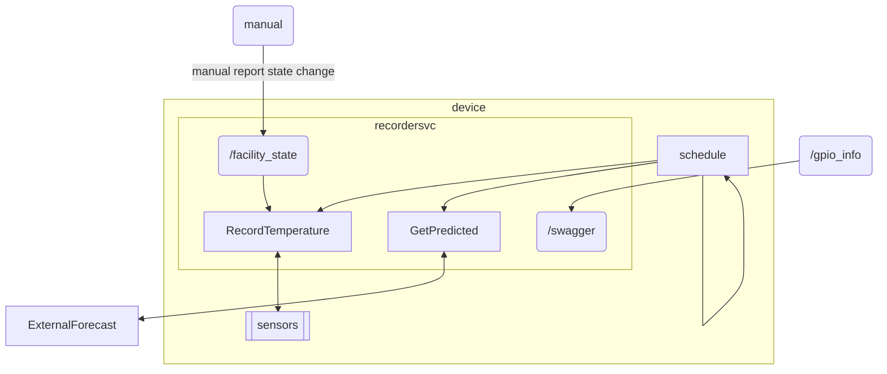
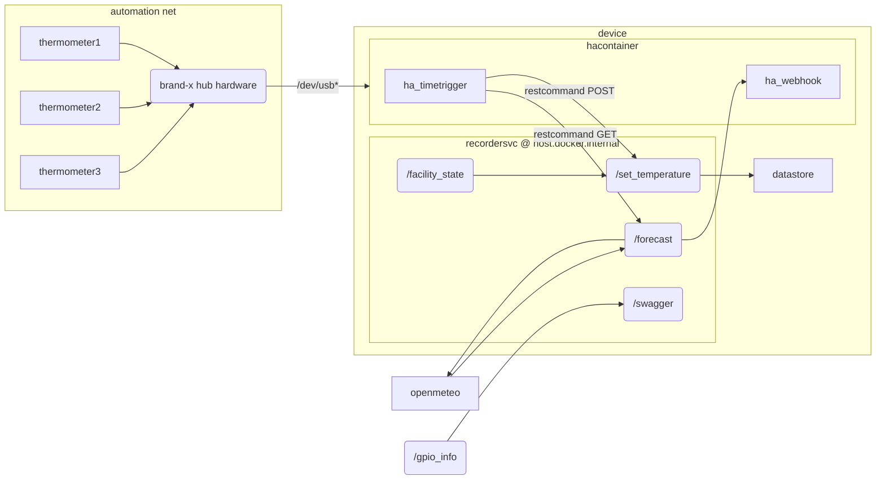

# Recorder

```mermaid
graph TB

subgraph device
    schedule
    subgraph recordersvc
        GetState(/swagger)
        RecordState( /facility_state)
        RecordTemperature
        GetPredicted
    end
    sensors
end

inquire(/gpio_info)
state(manual)
ExternalForecast
    
schedule-->schedule
inquire --> GetState
schedule-->RecordTemperature
RecordTemperature<-->sensors[[sensors]]
schedule-->GetPredicted
GetPredicted <--> ExternalForecast 
state --manual report state change--> RecordState
RecordState -->RecordTemperature
```

<https://learn.microsoft.com/en-us/archive/msdn-magazine/2005/march/scheduling-asp-net-code-to-run-using-web-and-windows-services>

## homeassistant peer

```mermaid
graph LR

openmeteo

subgraph device
    subgraph "recordersvc @ host.docker.internal"
        RecordTemperature(/set_temperature)
        GetPredicted(/forecast)
        RecordState(/facility_state)
        GetState(/swagger)
    end
    subgraph hacontainer
        ha_timetrigger
        ha_webhook
    end
    RecordTemperature --> datastore
end
subgraph "automation net"
    thermometer1 & thermometer2 & thermometer3 --> hub(brand-x hub hardware)
end
inquire(/gpio_info) 

hub -- /dev/usb* --> hacontainer

inquire --> GetState 
ha_timetrigger -- restcommand GET --> GetPredicted
ha_timetrigger -- restcommand POST --> RecordTemperature

RecordState -->RecordTemperature
GetPredicted --> ha_webhook
GetPredicted --> openmeteo --> GetPredicted
```
