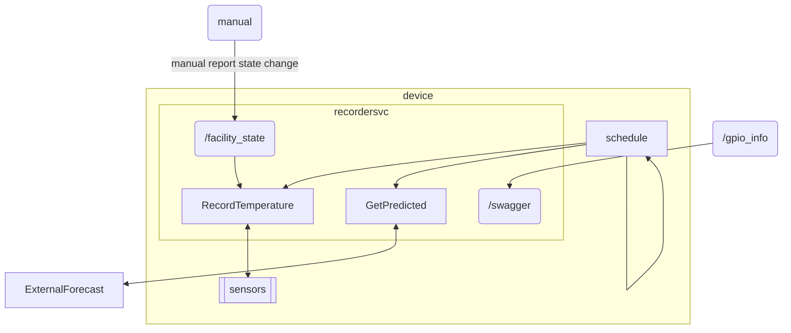
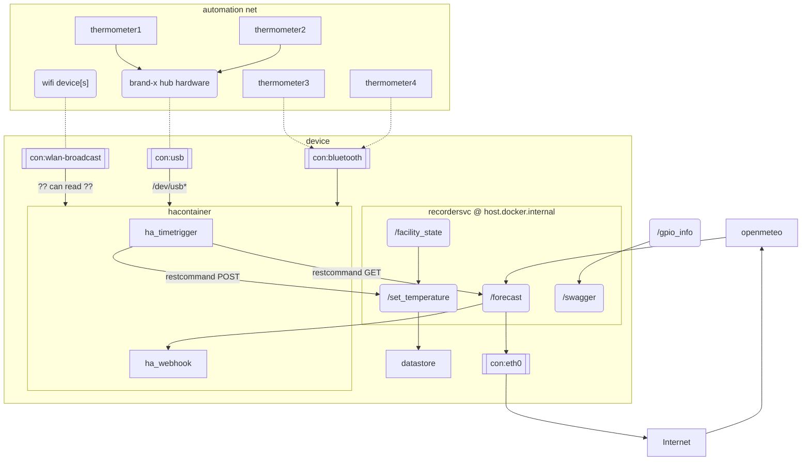

# Recorder

## All-in-one Service

<https://learn.microsoft.com/en-us/archive/msdn-magazine/2005/march/scheduling-asp-net-code-to-run-using-web-and-windows-services>

## homeassistant peer

- wired internet ()
- broadcast AP for smarthome-only traffic from devices

